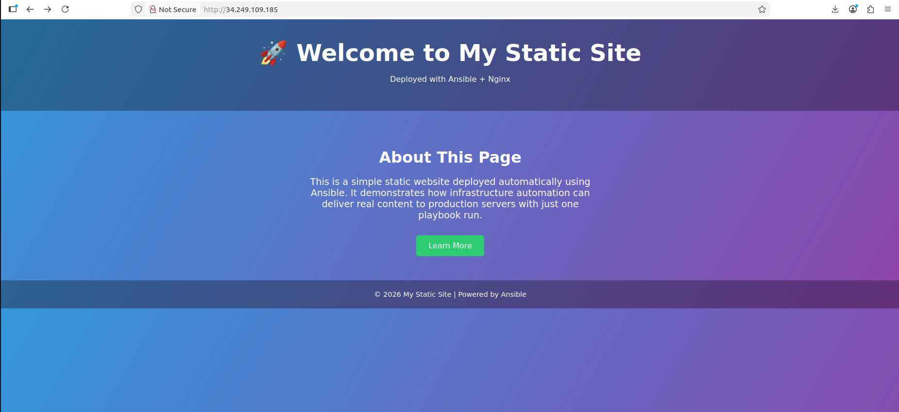

# Ansible Nginx Static Site Deployment

## Overview

This project demonstrates how to use Ansible to automate static website deployment on a target server using Nginx.

It covers:
- Configuring a control node to manage remote servers
- Installing and starting Nginx on the target machine
- Deploying a static HTML page to a production environment with Ansible playbooks

## Project Files

- `install_nginx_play.yml` — installs and starts Nginx on the target server
- `deploy_static_page_play.yml` — deploys the static HTML page to the web server
- `index.html` — static website content
- `Screenshot.png` — screenshot of the deployed website
- `README.md` — project documentation

## Inventory

- `servers` — general purpose managed nodes
- `prod` — production node hosting the static site

## Usage

Run the following commands from the control node:

```bash
ansible-playbook install_nginx_play.yml
ansible-playbook deploy_static_page_play.yml
```

## Result

The production server serves the static site successfully:



## What This Project Demonstrates

- Infrastructure automation with Ansible
- Web server provisioning with Nginx
- Static content deployment to a remote Linux server
- Basic configuration management and repeatable deployment workflow

## Future Improvements

- Add inventory file example
- Use Ansible roles for better structure
- Add CI/CD pipeline for automated deployment
- Parameterize variables for reusable environments

## Author

Muhammad Ali Mughal
